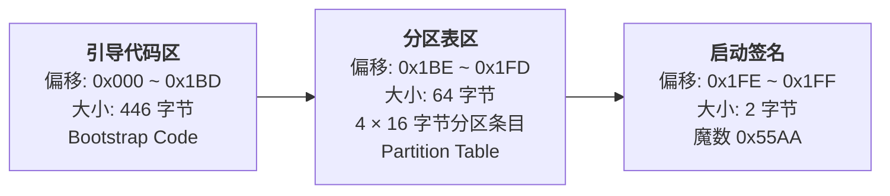

MBR（Master Boot Record）位于磁盘**第一个扇区（LBA 0）**，固定 512 字节，是 Legacy BIOS 启动的核心。整体分为三段：引导代码区、分区表区、启动签名。

地址说明：偏移从 0 开始计数，十六进制与十进制对应：

- 0x1BD = 445（引导代码区最后一个字节）
- 0x1BE = 446（分区表起始）
- 0x1FE = 510（签名起始）

MBR 的 446 字节引导代码（偏移 `0x000 ~ 0x1BD`）是一段**16 位 x86 实模式汇编程序**，BIOS 自检完成后会将其加载到内存 `0x7C00` 地址并执行。它的体积被硬限制在 446 字节（512 总字节 - 64 字节分区表 - 2 字节签名），因此功能极度精简，核心使命只有一个：**找到并加载下一阶段引导程序，完成控制权交接**。

不同系统（DOS/Windows、GRUB、Syslinux）的具体代码布局略有差异，但整体遵循标准范式。下面是最通用的精确分段结构：

总字节校验：3 + 59 + 354 + 30 = **446 字节**，刚好填满引导代码区。

